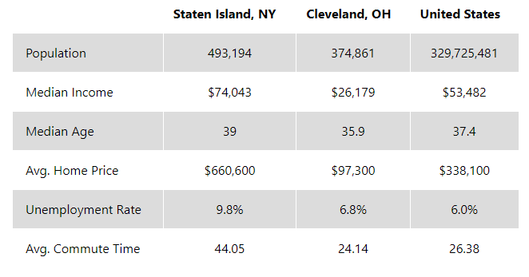

# Introduction {-}

Welcome to [Upland](https://upland.me) - a metaverse property trading game where users can buy, sell, trade, and develop virtual structures on properties that correspond to real world locations.

I chose Upland as the focus of my analytics study for a few reasons. First and foremost, the community has already developed tools for Upland players to do their own analysis. You can view overall market analytics [here](https://www.upland.me/marketplace-analytics). You can view user and neighborhood statistics and conduct property searches at [UPX Land](https://upxland.me/), which lets you download an Excel spreadsheet of your requested data. Also, since Upland properties match real world addresses on a one to one scale, I thought that these data sets would be great as sample real estate data sets. It allows us to manipulate property information that is realistic enough without being sensitive or hard to obtain. The key difference is that square footage and currency are measured in in-game units which were developed to ensure consistency and eliminate outside influences on the Upland market.

Please note that this project was done using RStudio. You may experience compatibility issues. If it doesn't work on your end, you may need to download all the files from the GitHub repository and change some of the references in this notebook to reflect the proper file locations. For this case, I set my working directory to this project's folder on my hard drive.

We are going to start with one of my favorite R programming rituals - loading packages.

```{r}
## I like to run a script for some of the packages that I use for analysis.
## It loads a group of commonly used data analysis packages - you do not need to use all of them for this analysis.
## I prefer to load them up all at once every time I start an Rstudio session out of habit.
## If some of these are new to you, I encourage you to take a moment to familiarize yourself with the package and its functions.

library(tidyverse)
library(ggplot2)
library('Tmisc')
library(SimDesign)
library(skimr)
library(janitor)
library(lubridate)
library(scales)
library(plotly)
library(usmap)
library(rmarkdown)
library(vitae)
```

# Preliminary Analysis & Cleaning {-}

Upland divides buyable land into cities and neighborhoods which are graded on a [tier scale](https://upland-guide.com/frequently-asked-questions/city-tiers-and-vanilla-mode/) based on real world price, city size, and prestige. Properties are priced accordingly in UPX, the game's currency. Prior to beginning this analysis, I wanted to see how closely these tiers align with real world real estate prices and average rents. This would give me an idea of how relevant this analysis would be as sample real estate data. 

There are some limitations to this since at this time we are only able to download a head of the properties data consisting of 10,199 entries. The developers seem to have drawn neighborhood lines in a way that is conducive to their metaverse. Real life surveys of the city also seem to differ on how these lines are drawn. I compared San Francisco neighborhoods and ranked them by Yield Per Month/UP2, which is the equivalent of price per square foot. Despite the limitations, I believe that my data set matches up well with real world data, with Russian Hill and Pacific Heights being the most expensive areas in the city. I did this in Excel with pivot tables to save time, as you can see in the presentation. Luckily, R has a lot of features that will let us quickly recreate that plot. Neighborhoods should have consistent pricing by design, mitigating the concern of a small sample size for certain neighborhoods.

As you will see, this will also give us an opportunity to do some data cleaning. 


```{r}
## Let's start by taking the CSV and creating an R data frame. Preview the data. I like to use the colnames function give myself a list of columns to use in later code blocks.

head <- read.csv('AllSFProps.csv')
str(head)
colnames(head)
```

```{r}
## Let's list the neighborhoods by price per square foot and count of entries.
## Let's go ahead and create a new column for price per square foot - I've already done it in Excel, but let's do it in R just because we can! 

head$UPX.Per.UP2 <- head$Yield.Per.Month / head$UP2

neighborhood_summary <- head %>%
  group_by(Neighborhood) %>%
  summarise(count = n(), mean_UPX = mean(UPX.Per.UP2))

sorted_table <- neighborhood_summary %>%
  arrange(desc(mean_UPX))

print(sorted_table)
```

Here, you may notice a problem. Our data set contains an entry in the "Union Street" district that yields less than it should. This is a result of an error - the property appears to be glitched and produces far less UPX per square foot than its neighbors. We also have an entry for the "Marina" district where the UPX is null. Before we create our plot, I'm going to remove these entries from our data frame. Just to be safe, we are also going to remove the "Crocker Amazon" and "Lone Mountain" districts because they both gave us single entries that were invalid.

### Note that this will change the data frame and running the previous steps may now cause contradictions.

```{r}
head <- head[!(head$Neighborhood %in% c("UNION STREET", "MARINA", "CROCKER AMAZON","LONE MOUNTAIN")), ]
```

We also found entries where the neighborhood field was null. This occurs on properties on the edge of the city limits where no neighborhood category can be assigned. Let's remove them from our data frame. It should remove exactly 28 entries. 

```{r}
head <- head[!is.na(head$Neighborhood) & head$Neighborhood != "", ]
```

### Now we are ready to create our chart!
It should look something like our other bar chart. We have removed the inconsistencies and null entries in our data and we should have an accurate representation of the land values in San Francisco, except the chart is printed in ascending order by default. We are also adjusting the labels so they read vertically, since there are so many neighborhoods.

```{r}
ggplot(data = head, aes(x = reorder(Neighborhood, UPX.Per.UP2), y = UPX.Per.UP2)) +
  stat_summary(fun = "mean", geom = "bar", fill = "steelblue") +
  labs(title = "Neighborhood Rents in UPX", x = "Neighborhood", y = "UPX Per UP2") +
  theme_minimal() +
  theme(axis.text.x = element_text(angle = 90, hjust=1))
```
If you don't like how this looks, you can change the bar width. You can also save the output to a .png file with larger dimensions if you so desire! It looks much better this way.

```{r}
plot <- ggplot(data = head, aes(x = reorder(Neighborhood, UPX.Per.UP2), y = UPX.Per.UP2)) +
  stat_summary(fun = "mean", geom = "bar", fill = "steelblue", width = .5) +
  labs(title = "Neighborhood Rents in UPX", x = "Neighborhood", y = "UPX Per UP2") +
  theme_minimal() +
  theme(axis.text.x = element_text(angle = 90, hjust=1))

ggsave(filename = "NeighborhoodsByYield.png", plot = plot, width = 32, height = 24)

```

## So far so good! We've shown that there is some internal validity to our data sources. 

If you want to take a break, now would be a good time, but if you close this window and come back, remember to reload the packages in the very first code chunk!

# Step One: Ask

We are now going to turn our focus on answering business questions. We have downloaded the complete portfolio of a user containing 544 properties. We are going to treat this as if it were the holdings of a real estate company that manages residential and commercial properties in various cities around the globe. This can be found in the properties-table-data .xlsx and .csv files. Feel free to take some time to familiarize yourself with this data set. 

The company wants to know which markets have proven to be the most profitable investments. They also want to know if any particular properties have proven to be bad investments. The company remains interested in both buying and selling properties. We have devised three primary research questions for our stakeholders. We must answer each of them and provide advice and solutions. Here are the three main questions of our analysis:

## Which cities and neighborhoods have the highest land value?
## Which properties have not been profitable purchases?
## Which cities and neighborhoods have the highest ROI?

# Step Two: Prepare

I have downloaded my own user data from UPX Land. You can see it in the properties-table-data spreadsheet and CSV files. UPX Land allows us to select and download this information from the menu on the webpage in a few clicks. This makes our preparation stage very easy. I simply exported the spreadsheet as a CSV so that we can import that into R. Let's do that now. I'm going to call this data frame "company", since it represents the holdings of a hypothetical real estate company.

```{r}
company <- read.csv('properties-table-data.csv')
```

# Step Three: Process

We saw some issues with the data entry in some values when looking at a preview of the entire city of San Francisco. Fortunately, this data set only has 544 entries. It does not contain any special properties or properties that are glitched. However, let's run a few data cleaning steps just to be certain that we can run calculations on this data set without worrying about errors. 

```{r}
## First, let's scan the entire document for null entries.
## In our previous set, we had null entries for neighborhood and UPX yield. Hopefully, we won't have the same problems with this set. 

null_counts <- colSums(is.na(company))
print(null_counts)
```

Great! The property data contains zero null entries! The nulls that we see are the result of certain properties being up for sale and making use of fields like "markup" which denotes the difference between last sale price and current sale price. The company is currently listing 19 properties for sale, leaving 525 out of 544 null entries in these fields.

```{r}
## Next, let's determine if neighborhood prices are consistent throughout our document. We will need to create a UPX.Per.UP2 column for this data frame.
## To achieve this we will first need to convert the column data type to numeric, otherwise we will get error messages.

company$Yield.Per.Month <- as.numeric(company$Yield.Per.Month)
company$UP2 <- as.numeric(company$UP2)

company$UPX.Per.UP2 <- company$Yield.Per.Month / company$UP2
```

If you can run this chunk without any errors, your new column should already be in your company data frame. This column gives us a calculation of UPX yield per square foot, similar to the previous example. We know that properties within neighborhoods should be consistently priced, so checking if their UPX.Per.UP2 is consistent throughout all neighborhoods in our holdings should give us an idea of how clean our data set is. 

```{r}
variance_by_neighborhood <- company %>%
  group_by(Neighborhood) %>%
  summarize(variance = var(UPX.Per.UP2, na.rm = TRUE))
 
print(variance_by_neighborhood)
```

A NA Result indicates that there is only one entry for this neighborhood. This means there is no variance. If you wanted to go the extra mile, you could compare their UPX.Per.UP2 value with those of properties outside of this company's holdings to make sure that they are accurate. For the remainder of our entries, the variance is zero or negligible, so it is safe to say that everything is consistently priced. 

Great job! We've prepared and processed our data set. Now, let's get to the analysis!

# Step Four: Analyze

Let's go back to our research questions. Which cities and neighborhoods have the highest land value? Which properties have not been profitable purchases? Which cities and neighborhoods have the highest ROI? The following sections will answer these analysis questions.

As a preliminary inquiry, I want to find out the count of properties in each city and in each neighborhood within each city.

```{r}
## Broken down by city: 
count_entries <- company %>%
  group_by(City) %>%
  summarize(Count = n()) %>%
  arrange(desc(Count))
print(count_entries)

## Broken down by neighborhood:

count_entries2 <- company %>%
  group_by(City, Neighborhood) %>%
  summarize(Count = n(), .groups = "drop") %>%
  arrange(desc(Count))
print(count_entries2)
```

These two tables give us a count of properties in each neighborhood. Our company has more properties in Chicago than any other city. 

## Question 1: Which cities and neighborhoods have the highest land value? 

For these calculations, we will need to create a new column for our data frame. This column will calculate mint price per square foot, rather than rental income per square foot. This reflects the original mint price of the property, which should be consistently scaled in each neighborhood based on the same criteria. We will call it Value.UP2. 

```{r}
company$Value.UP2 <- company$Mint.Price / company$UP2
```

Now we can use this new variable to organize cities and neighborhoods by land value per square unit of land area. It operates similar to the two tables before where we counted the number of entries in each city and each neighborhood. This time, we are 

```{r}
value_by_city <- company %>%
  group_by(City) %>%
  summarize(Value.UP2 = mean(Value.UP2, na.rm = TRUE), Count = n(), .groups = 'drop') %>%
  arrange(desc(Value.UP2))
print(value_by_city)

value_by_neighborhood <- company %>%
  group_by(City, Neighborhood) %>%
  summarize(Value.UP2 = mean(Value.UP2, na.rm = TRUE), Count = n(), .groups = 'drop') %>%
  arrange(desc(Value.UP2))
print(value_by_neighborhood)
```

It shouldn't come as a surprise to anyone in the Upland community that London is found to be the most expensive city, while Bakersfield and Fresno are considered the cheapest. London is new and it was designed to be more exclusive, whereas Bakersfield and Fresno were designed to be more affordable for newer and younger players. 
Bakersfield and Fresno, our least expensive cities, differ a lot in the Value.UP2 column. But according to Bestplaces.net, the difference in actual home values is not that great. 

Our list also shows Staten Island ranking below Cleveland, but the real-life statistics differ a lot. We will discuss these contradictions in greater detail later on. 


## Question 2: Which properties have not been profitable purchases?

The reason we are tackling this question before the other neighborhood/city data question is because some of the properties in our holdings have been traded around in the past, and the last sale price does not necessarily reflect the original purchase price. We need to determine which properties these are so that we can handle each properly in our final calculations. Luckily, we acquired most of our properties at the mint price. Therefore, in order to find the outliers, we simply need to find the entries where the values in the Mint.Price and Last.Price columns don't match. Let's produce a list of those properties now.

```{r}
price_mismatch <- company[company$Mint.Price != company$Last.Price, c("Address", "City", "Mint.Price", "Last.Price")]
print(price_mismatch)
```

This shows 70 out of 544 entries (~12.87%) being purchased after minting. This automatically means that these properties do not produce the optimal ROI. It does not necessarily mean that they were bad purchases. Some of these purchases may have been made to complete an Upland collection, or for some other reason that attracted us to buy despite not getting the mint price. We are going to have to narrow down this list a bit. Unfortunately, the situations for each of these must be evaluated individually.

### Entries 2-14: These Fresno properties were purchased aftermarket as part of deals with other companies. We will consider anything above twice mint and outside of any collections to be unjustifyable and a losing buy. This means out of all of these, the only unacceptable entry is #2, 315 W Byrd Ave. The Laval Avenue properties are part of the Woodward Park collection. 
### Entries 15, 137, 212 &  220: These properties were bad buys according to the same criteria. They are not part of any collection.Many were acquired because we thought it was our only chance to enter the Rio market before newer properties were available for mint. 
### Entries 16-18: These three properties were purchased from other companies in Fresno. #18 is considered to be a bad purchase for the same reasons - it was aquired for too much to justify the purchase.
### Entries 19 & 22 were probably made during the early days of Brooklyn mintage. We cannot justify their purchase at such high prices.
### Entry 23: Even though this property is part of a collection, we do not consider the near 6x markup to be worthwhile.
### Entry 24: This markup is considered within the acceptable range and this property will be eliminated from the final list. 
### Entry 25: Despite the presence in the Van Ness Collection, we do not consider our purchase price a good price for this property. 
### Entry 27, 63 & 87: Despite the presence in the North Growth Area Collection, we do not consider our purchase price a good price for this property.
### Entry 28: Despite the presence in the Van Ness Collection, we do not consider our purchase price a good price for this property.
### Entries 29, 40, & 43: Despite the presence in the Glenville collection, we do not consider our purchase price a good price for this property. They were acquired from another company at markup.
### Entries 30 & 172: Despite the presence in the Great Kills collections, we cannot justify this purchase price.
### Entry 34: Purchased for more than twice mint, no collection value.
### Entries 44 & 48: We spent far too much for these without any collectable value.
### Entry 55: This was a bad purchase statistically. We will forgive it since it is the only property we are able to hold in Birmingham for the time being.
### Entry 65: This property falls short of our key metrics, but we will not count this as a bad purchase because it was part of a deal we made a few years ago to develop the Dogpatch neighborhood, for which we were compensated.
### Entries 74, 324, 340 were found to be within the acceptable range of markup and will be excluded from the final list.
### Entries 76, 88, 115, 219, 285, 339 have inflated sale prices because they were used in a swap deal with another company in the past. Since we were the original minters of the properties, we will not include this one in the final list.
### Entries 78, 236, 250, 307 are the another result of a swap deal that can't be included in the final list.
### Entry 147 was purchased with an acceptable markup and will be removed from the final list. 
### Entries 160, 176, & 213: Despite being in the Blue Hills collection, we cannot justify the heavy markup for these purchases.
### Entry 195 will be an exception to our criteria since it is the last property in Rutherford that we are holding, and the markups in that area exceed the markup we paid for it.
### Entry 261 is another Fresno property that we overpaid for, and should be included in the final list. 
### Entry 368 shows an attempt to grab an Oakland collection, but we paid way too much for it. It has not been a profitable investment.
### Entry 372 fails to meet our criteria of a good purchase and will be included on the final list. 
### Entry 389 meets the criteria by a 200 UPX, and will be removed from the final list. 
### Entries 410, 440, & 443 barely meet the criteria and they are part of a collection. They will be removed from the final list. 
### Entry 420 fails to meet our criteria of a good purchase and will be included on the final list. 
### Entry 441 will be excluded from the final list because it was purchased as part of a bundle in the Rancho Oakey collection, which means that it can still be considered a decent buy. 
### Entry 447 was purchased because at the time the Fresno ballpark was considered an iconic property. This has proven to be an unprofitable buy. 
### Entry 475 fails to meet our criteria because we do not have a complete Leblon collection. We overpaid for this single property. 
### Entry 477 is an iconic Little Italy property that can still flip for greater than our purchase price, so we will not include this one in our final list. 

WHEW! I hope reading that was less painful for you as going through all of those transaction records was for me. At least now we have an idea of what our final list of bad buys is going to look like. Let's eliminate these from the price_mismatch data frame for our final list! 

```{r}
# Addresses to remove
addresses_to_remove <- c("1137 A ST", "3025 E NORWICH AVE", "2923 E NORWICH AVE", "2955 E INDIANAPOLIS AVE", "3018 E INDIANAPOLIS AVE", "2912 E NORTHDALE AVE", "1112 MAYOR AVE", "6336 W WRENWOOD LN", "1136 MAYOR AVE", "7222 N LAVAL AVE", "7234 N LAVAL AVE", "9534 N WOODROW AVE", "1267 N SIERRA VISTA AVE", "3935 E CLAY AVE APT 202", "44 CARPENTERS RD", "1220 N FINE AVE", "675 TENNESSEE ST", "10012 JERSEY BOUNCE DR", "6815 N CRYSTAL AVE", "643 E 73RD TER", "4009 INDIANA AVE", "3943 COLLEGE AVE", "4011 COLLEGE AVE", "4405 HARRISON ST", "614 TRACY AVE", "808 NE 60TH TER", "384 UNION AVE", "7331 HOLMES RD", "11401 NORBY RD", "928 E 73RD ST", "18110 HARLOW ST", "135 DANIEL AVE", "2155 18TH AVE", "9602 N CHARLOTTE ST", "9612 N CHARLOTTE ST", "3009 BRYANT AVE", "9600 N CHARLOTTE ST", "372 BROOME ST")

price_mismatch_filtered <- price_mismatch[!price_mismatch$Address %in% addresses_to_remove, ]

rownames(price_mismatch_filtered) <- NULL


print(price_mismatch_filtered)
```

Great! We now have 32 entries that are considered bad purchases. That's 32/544 or about 6%. Not bad! In the next steps of our analysis, we will offer some insight as to how this happened and suggestions about what to do with them. For now, we have another analytics question to answer! 

## Question 3: Which cities and neighborhoods have the highest ROI? 

This calculation will be somewhat similar to those of the first question of the analysis. This time, however, we are looking to calculate using the paid price rather than the mint price for each property. This figure will be divided by the last price to give us a ratio of months for the investment to pay itself off. 

```{r}
company$ROI <- company$Yield.Per.Month / company$Last.Price
```

This creates a new column for ROI. We are now ready to rank the neighborhoods and cities accordingly. 

```{r}
ROI_by_city <- company %>%
  group_by(City) %>%
  summarize(ROI = mean(ROI, na.rm = TRUE), Count = n(), .groups = 'drop') %>%
  arrange(desc(ROI))
print(ROI_by_city)

ROI_by_neighborhood <- company %>%
  group_by(City, Neighborhood) %>%
  summarize(ROI = mean(ROI, na.rm = TRUE), Count = n(), .groups = 'drop') %>%
  arrange(desc(ROI))
print(ROI_by_neighborhood)
```

These results reflect the standardization of the price scheme in Upland. In cities where we have only made mint purchases, we have the best ratio. In cities where we have purchased properties from other users such as Staten Island, our ratio is much worse. It appears that our ratio is not influenced by the overall land values of each market. 

Congratulations! We've tackled all of our analytical questions. Next, it is time to share the results with our stakeholders. 

#Step Five: Share

This is the part where we state the results and create visualizations. In our first data question, we decided to determine broadly which areas were the highest in land value. This is an objective measurement and the results were not surprising to us. 


```{r}
ggplot(value_by_city, aes(x = Value.UP2, y = seq_along(City), size = Value.UP2, color = Value.UP2)) +
     geom_point() +
     scale_size_continuous(range = c(3, 10)) +  
     scale_color_gradient(low = "blue", high = "red") +  
     labs(title = "Cities Ranked by Land Value", x = "Land Value", y = "Ranking") +
     theme_minimal()
```

This chart shows us the dramatic difference in overall land value between London and the rest of the cities. Since we know London was designed to be more exclusive while cities like Fresno were designed to be more accessible to players with less funds, this is to be expected.
Let's say we wanted the dot size to represent the count of properties in our company's holdings rather than the land value. This can be done with slight modification of this code. I will also add labels to this chart to show you how it can be done. 

```{r}
ggplot(value_by_city, aes(x = Value.UP2, y = seq_along(City), size = Count, color = Value.UP2)) +
  geom_point() +
  scale_size_continuous(range = c(3, 10)) +
  scale_color_gradient(low = "blue", high = "red") +
  labs(title = "Cities Ranked by Land Value", x = "Land Value", y = "Ranking") +
  geom_text(aes(label = City), hjust = -0.2, size = 3) +  # Add city labels
  theme_minimal()
```

Great! If this looks cramped on your end, feel free to play with the chart dimensions to get it to look better. Our chart resembles an inverse exponential regression equation. Could the developers have used such a function in order to grade and set price scales for each city? 
Now, let's turn our attention to question two. 

Some of these properties were purchased with an extreme markup! In order to visualize this, we need to first add a column to our price_mismatch_filtered table. We are going to divide last price by mint price to get a ratio. 

```{r}
price_mismatch_filtered$Price_Ratio <- price_mismatch_filtered$Last.Price / price_mismatch_filtered$Mint.Price
```

One way to visualize this is with a histogram, which gives us an exact count of each ratio in our data set. 

```{r}
ggplot(price_mismatch_filtered, aes(x = Price_Ratio)) +
  geom_histogram(binwidth = 0.5, fill = "steelblue", color = "white") +
  labs(title = "Price Ratio Distribution", x = "Price Ratio", y = "Frequency") +
  theme_minimal()
```

Alternatively, we can express this as a density plot. this shows that most of the bad purchases that we have made are between a 3:1 and 4:1 last to mint price ratio. This chart is a bit more visually appealing, but less precise in the way it conveys information.

```{r}
ggplot(price_mismatch_filtered, aes(x = Price_Ratio)) +
  geom_density(fill = "steelblue", color = "white") +
  labs(title = "Price Ratio Distribution", x = "Price Ratio", y = "Density") +
  theme_minimal()
```

Our third question was about return on investment. Let's create a plot of ROI by city that includes the count of properties per city in the portfolio. Cities where we did not purchase any post-mints will meet a benchmark ratio of .012. The rest of them will be shown accordingly. This chart shows that Bakersfield is the first city to fall beneath the threshhold. 

```{r}
benchmark_roi <- 0.012

## Add a benchmark label
first_below_benchmark <- ROI_by_city$City[which.min(ROI_by_city$ROI > benchmark_roi)]


## Create our plot
ggplot(ROI_by_city, aes(x = ROI, y = reorder(City, ROI))) +
  geom_bar(stat = "identity", fill = "steelblue") +
  geom_hline(yintercept = benchmark_roi, linetype = "dashed", color = "red", size = 1) +
  geom_text(aes(label = sprintf("%.2f", ROI)), hjust = -0.1, color = "white") +
  geom_text(aes(x = ifelse(City == first_below_benchmark, benchmark_roi + 0.005, NA), label = ifelse(City == first_below_benchmark, "Benchmark", "")), hjust = 0, vjust = -0.5, color = "red", fontface = "bold") +
  labs(title = "ROI by City", x = "ROI", y = "City") +
  theme_minimal()
```

We have been avoiding neighborhood-by-neighborhood comparisons so far because there are so many neighborhoods and it would make for a cluttered visualization. However, I will include one here for good measure, using the neighborhoods of Kansas City as an example. 

```{r}
kansas_city_neighborhoods <- ROI_by_neighborhood %>%
  filter(City == "Kansas City")

first_below_benchmark_KC <- kansas_city_neighborhoods$Neighborhood[which.min(kansas_city_neighborhoods$ROI > benchmark_roi)]

ggplot(kansas_city_neighborhoods, aes(x = ROI, y = reorder(Neighborhood, ROI))) +
  geom_bar(stat = "identity", fill = "steelblue") +
  geom_hline(yintercept = benchmark_roi, linetype = "dashed", color = "red", size = 1) +
  geom_text(aes(label = sprintf("%.2f", ROI)), hjust = -0.1, color = "white") +
  geom_text(aes(x = ifelse(Neighborhood == first_below_benchmark_KC, benchmark_roi + 0.005, NA), label = ifelse(Neighborhood == first_below_benchmark_KC, "Benchmark", "")), hjust = 0, vjust = -0.5, color = "red", fontface = "bold") +
  labs(title = "ROI by Neighborhood in Kansas City", x = "ROI", y = "Neighborhood") +
  theme_minimal()
```

We have a bit of a problem here. Since Blue Hills and Oak Park Southeast contain properties that have been used in swap deals, the last price doesn't necessarily reflect the accurate price and thus the ROI for these zones. We mentioned this earlier when making exceptions to the price_mismatch table.
Let's try the same thing in New Orleans, where business has been stagnant. Hopefully we won't see these exceptions. 

```{r}
nola_neighborhoods <- ROI_by_neighborhood %>%
  filter(City == "New Orleans")

first_below_benchmark_nola <- nola_neighborhoods$Neighborhood[which.min(nola_neighborhoods$ROI > benchmark_roi)]

ggplot(nola_neighborhoods, aes(x = ROI, y = reorder(Neighborhood, ROI))) +
  geom_bar(stat = "identity", fill = "steelblue") +
  geom_hline(yintercept = benchmark_roi, linetype = "dashed", color = "red", size = 1) +
  geom_text(aes(label = sprintf("%.2f", ROI)), hjust = -0.1, color = "white") +
  geom_text(aes(x = ifelse(Neighborhood == first_below_benchmark_nola, benchmark_roi + 0.005, NA), label = ifelse(Neighborhood == first_below_benchmark_nola, "Benchmark", "")), hjust = 0, vjust = -0.5, color = "red", fontface = "bold") +
  labs(title = "ROI by Neighborhood in New Orleans", x = "ROI", y = "Neighborhood") +
  theme_minimal()
```

Since there have been no third party purchases in New Orleans, all of the properties have the same ROI metric.
If you aren't exhausted of this yet, we can try one more city. Let's try Brooklyn, where we have both fresh mints and aftermarket properties.

```{r}
bk_neighborhoods <- ROI_by_neighborhood %>%
  filter(City == "Brooklyn")

first_below_benchmark_bk <- bk_neighborhoods$Neighborhood[which.min(bk_neighborhoods$ROI > benchmark_roi)]

ggplot(bk_neighborhoods, aes(x = ROI, y = reorder(Neighborhood, ROI))) +
  geom_bar(stat = "identity", fill = "steelblue") +
  geom_hline(yintercept = benchmark_roi, linetype = "dashed", color = "red", size = 1) +
  geom_text(aes(label = sprintf("%.2f", ROI)), hjust = -0.1, color = "white") +
  geom_text(aes(x = ifelse(Neighborhood == first_below_benchmark_bk, benchmark_roi + 0.005, NA), label = ifelse(Neighborhood == first_below_benchmark_bk, "Benchmark", "")), hjust = 0, vjust = -0.5, color = "red", fontface = "bold") +
  labs(title = "ROI by Neighborhood in Brooklyn", x = "ROI", y = "Neighborhood") +
  theme_minimal()
```

By now, it should be pretty clear which properties were obtained for a less than ideal price. Let's move on. 

# Step Six: Act

We have posed our analytical questions and we have tackled each of them. we have communicated the results to our stakeholders. Next, we must make recommendations based on our findings! 
The ways in which I would advise this hypothetical real estate firm could vary tremendously. For now, let's assume that their goal is to increase growth and profit margins. Let us also assume that the company has a sufficient budget to continue expansion. However, we are going to treat market conditions as they are in the metaverse rather than in the real world. 

## Land Value Inquiry

London is a city that is in very high demand. High land values mean high rents, which means more revenue for the company. London's expensive entry prices also means that the competition has less opportunity to grab the land. Additionally, We have not seen the same level of growth in American cities such as Los Angeles, New Orleans, and Kansas City. Markets in these cities are stagnant. It seems like market interests have shifted abroad. For example, Rio de Janeiro sold out rapidly after its release, while US cities such as Chicago and Kansas City have yet to sell out.
Due to all of these reasons, it is our formal recommendation to focus on London when purchasing new properties. 


We would also like to advise at this time that the company stops purchasing properties from other companies. Going for collections and other bonuses on properties like this have resulted in a diminished ROI. The benefits that we get from these do not outweigh the costs of purchasing properties at a steep markup. 

## Properties That Have Been Less Than Profitable

We advise that properties which fail to meet our benchmarks of profitability be developed and improved. It is worth investing the time and money into making these properties more profitable for the company. It would increase revenues in the long run. We can do this by increasing the number of rental units available on these properties. In most neighborhoods, this would be the ideal way to raise revenue. However, we also have properties that are not in the best condition. 
In places such as Fresno, Bakersfield, and Brooklyn, improving existing structures would be the better way to go. Improving properties in these areas could be thought of as an act of community service, since many neighborhoods in these cities are suffering from urban blight and decay. Houses and commercial spaces in these places need to undergo renovations.
It is our official recommendation that the company begin several construction projects to make these properties more desirable and yield more income for the company. 

An alternate strategy would be to sell those properties at a fair market price and then use those funds to purchase properties in better locations such as London. The problem with this is that we would have to determine what we are sacrificing in monthly yield and compare that to what we would gain with the new property. This would mean moving a lot of funds around to gain assets that ultimately produce a similar net yield per unit of currency invested. It also means that we have to eat the losses from the original purchase.
We consider the first strategy to be superior. However, if the company would rather get rid of the assets in question, this would be the optimal way to do so. 

## ROI By Area

We have shown that our investments were best placed in the following cities: Nashville, Santa Clara, Porto, London, Queens, Chicago, Los Angeles, Arlington, New Orleans, and Bakersfield.
Of these cities, there remains a significant amount of property for sale at the mint price in Nashville, London, Queens, Los Angeles, and Arlington. If we are looking to simply maximize the yield per investment, seeking out those properties would be the optimal strategy for growth. 
We consider London to be the hottest and fastest moving market at this moment. We should aim to pick up London properties before it's too late. 
Our secondary priority should be Nashville. Nashville properties will likely never flip for a profit, but they will provide us rental income. It is not a very competitive market and we have plenty of time to add Nashville properties to our portfolio without taking any markups. 
Our third priority would be Los Angeles. The land available there is slightly less desirable than the land in Nashville. Furthermore, we expect more people to be leaving coastal zones for the hinterlands in the coming years as economic conditions change. Therefore, Nashville demand should increase and LA demand should decrease. However, there is still ample room for getting in at mint price. We do not expect LA properties to flip for a profit any time soon. Additionally, certain neighborhoods in LA are geographically isolated and often overlooked by real estate companies. 

# Conclusion

Thank you for staying with me through all of this! I know it is not the easiest example to follow, but I think it is a good one for demonstrating skills with R programming. I look forward to doing another analysis!
